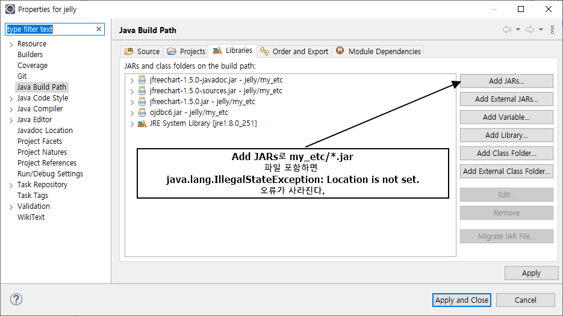

# jelly

</img>

[JavaFX embed scene in scene](https://stackoverflow.com/questions/22161586/javafx-embed-scene-in-scene)
[Customize ListView in JavaFX with FXML](https://stackoverflow.com/questions/19588029/customize-listview-in-javafx-with-fxml)
